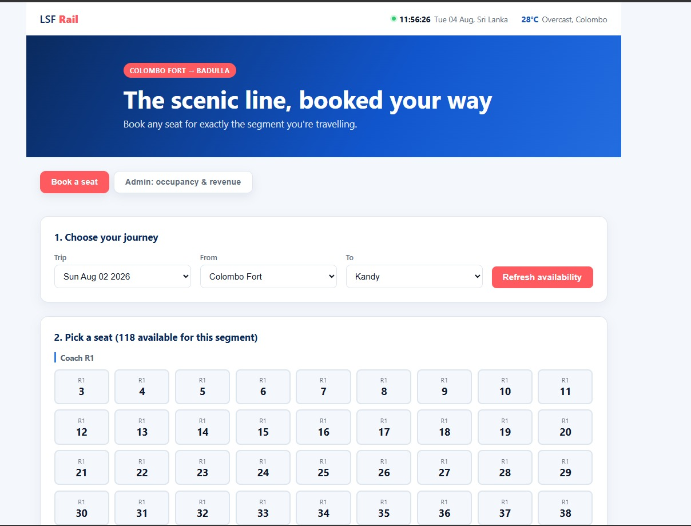
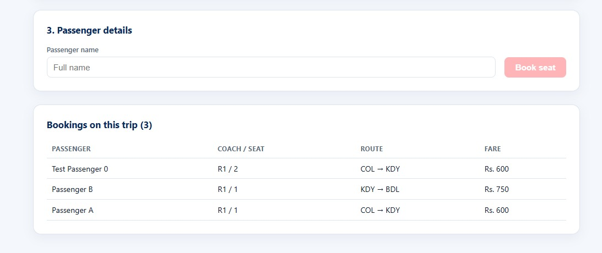
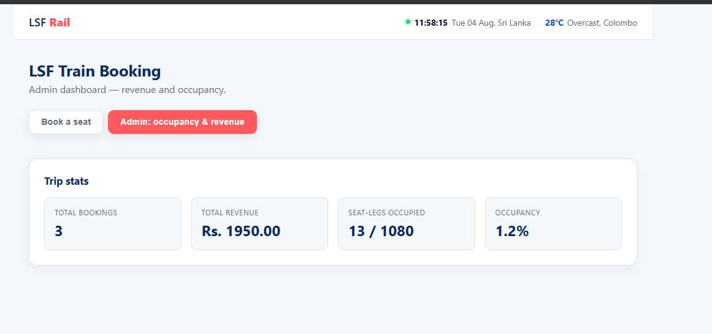

# LSF Train Booking - Segment-Based Seat Booking System

A booking system for the Colombo Fort to Badulla scenic line that lets a single reserved seat get booked by more than one passenger, as long as their journeys don't overlap. One passenger can ride Colombo Fort to Kandy, and someone else can take the same seat from Kandy to Badulla, and both only pay for the distance they actually travel.

## Quick start

```bash
cp backend/.env.example backend/.env
docker compose up --build
```

- Frontend (booking UI): http://localhost:5173
- Backend API: http://localhost:4000
- Postgres: localhost:5432 (user `lsf`, password `lsf_dev_password`, db `lsf_booking`)

On first boot the backend applies the Prisma migration and seeds the database from `backend/config/route.json` (stations, coaches, seats, fare-per-leg).

## Tech stack

- **Backend:** Node.js, TypeScript, Express, Prisma ORM
- **Frontend:** React, TypeScript, Vite
- **Database:** PostgreSQL
- **Testing:** Vitest (integration tests run against a real database)
- **Orchestration:** Docker Compose

## Design decisions

### 1. Tracking occupancy with per-leg rows and a unique constraint

Each station has a `sequence` number, its position along the route starting at 0. I think of a "leg" as the stretch of track between two consecutive stations, so a journey from sequence 2 to sequence 5 covers legs 2, 3, and 4.

Occupancy lives in a `booked_legs` table, one row per trip/seat/leg combination, with a unique constraint on `(tripId, seatId, legIndex)`.

When someone books a seat, the backend opens a transaction, creates the `SeatBooking` row, then inserts a `BookedLeg` row for each leg in the range. If any of those legs is already taken, the unique constraint throws and the whole transaction rolls back, including the `SeatBooking` row. The caller just gets back a 409. Nothing about this relies on application code getting the locking right; the database enforces it through the constraint.

I didn't want to just claim this works, so `backend/scripts/concurrency-test.ts` fires 10 booking requests at the same seat and segment at the same time. Every run gives the same result: 1 succeeds, 9 get rejected. There's also an automated test in `backend/src/services/booking.test.ts` doing the same thing with 8 concurrent requests against the service layer directly.

I also considered a bitmask approach: one integer or bit-string column per seat/trip, updated atomically with something like `UPDATE ... SET mask = mask | :range WHERE (mask & :range) = 0`. It would mean one row and one round trip instead of several inserts, so it's probably faster on paper. But it's harder to query (you'd need to unpack bits just to answer "which legs are free right now"), harder to debug, and it doesn't scale well if the route grows past whatever integer width you picked. For a train schedule, which isn't exactly high-frequency trading, I'd rather have a model that's easy to read and explain than squeeze out a bit of extra throughput I don't need.

### 2. Trips are scoped to a date

A `Trip` is one scheduled run of the route on a given day. Since occupancy is scoped to `(tripId, seatId, legIndex)`, seats free up again the next day automatically, which matches how the actual timetable works.

### 3. Nothing is hardcoded

Stations, coaches, seats per coach, and the fare per leg all come from `backend/config/route.json`, which the seed script reads. Adding a coach or extending the line to a new station is a config edit, not a code change.

### 4. Unreserved coaches aren't part of the booking system

The assignment is specifically about making reserved seats resellable per segment. Unreserved coaches are first-come-first-served with no assigned seats, so they exist in the data model (mostly so future capacity reporting has somewhere to hook in) but don't have `Seat` rows or a booking flow.

### 5. Schema is managed with a real migration

Early on I used `prisma db push` because it's fast while the schema is still moving around. Once things settled I generated a proper migration with `prisma migrate dev` and committed it, and switched the container to run `prisma migrate deploy` on boot, which is the normal way to apply schema changes in any real environment.

## API reference

| Method | Path                              | Description                                      |
|--------|-----------------------------------|---------------------------------------------------|
| GET    | `/health`                         | Checks the database connection                     |
| GET    | `/stations`                       | Lists all stations in route order                   |
| GET    | `/trips`                          | Lists scheduled trips                                |
| GET    | `/trips/:tripId/availability`     | `?origin=CODE&destination=CODE`, returns free seats for that segment |
| GET    | `/trips/:tripId/bookings`         | Lists all bookings for a trip                        |
| GET    | `/trips/:tripId/stats`            | Revenue and occupancy numbers for a trip               |
| POST   | `/trips/:tripId/bookings`         | Books a seat: `{ seatId, originStationCode, destinationStationCode, passengerName }` |

## Testing

```bash
docker compose exec backend npm test              # automated integration tests
docker compose exec backend npm run test:concurrency   # concurrency proof against the live API
```

These run against a real Postgres instance rather than a mocked one. The whole point of the system is a database constraint doing the correctness work, so mocking the database would just be testing my mocks.

## Extra credit

- **Admin view** (`/trips/:tripId/stats` and the Admin tab in the UI): total bookings, total revenue, and seat-leg occupancy for a trip.
- **Handling conflicts gracefully in the UI:** if a booking request comes back with a 409 because someone else grabbed an overlapping leg between the time the user loaded availability and when they clicked book, the UI shows an error and refreshes the seat grid instead of leaving a stale, unbookable seat sitting there.

## Extra credit I skipped

The assignment itself says a solid core beats a pile of extras, so I kept these out on purpose:

- **A visual seat map** (an actual carriage layout) - the seat grid already communicates availability by coach and seat number well enough, and a floor-plan diagram felt like polish rather than something that changes the core value.
- **Waitlisting for full segments** - this would need a queue and some kind of notification system, and felt like more scope than I had time for.

## Challenges I ran into

- **Prisma on Alpine Linux:** `node:20-alpine` doesn't ship OpenSSL by default, and without it Prisma's query engine failed at startup with a fairly cryptic error. I fixed it by installing `openssl` in the Dockerfile and setting `binaryTargets = ["native", "linux-musl-openssl-3.0.x"]` in `schema.prisma`.
- **Actually proving the concurrency guarantee:** I didn't want to just reason about why the unique constraint should work and leave it there. Both the concurrency script and the Vitest suite fire real parallel requests at the same seat and check that exactly one wins, so the claim is backed by something I actually ran.
- **Moving from prototyping to a real migration:** started fast with `prisma db push`, then once the schema stopped changing I generated a proper migration and switched the container over to `migrate deploy`, closer to how you'd actually run this somewhere real.

## Project stages

See the commit history for the full progression, but roughly:

1. Foundations and design - repo scaffold, data model, docker-compose
2. Backend core - stations, availability, the transactional booking logic
3. Fare calculation, input validation, automated and concurrency tests
4. Frontend booking UI
5. Real migration, admin extra credit, final polish

## Repository

https://github.com/Perera1325/lsf-train-booking

## Screenshots

### Booking flow


### Seat selection


### Admin dashboard

